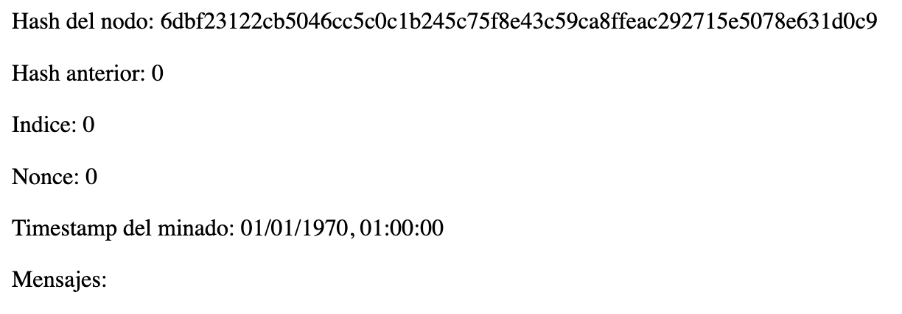
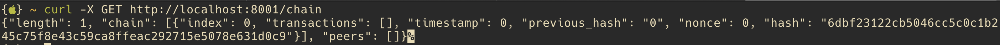
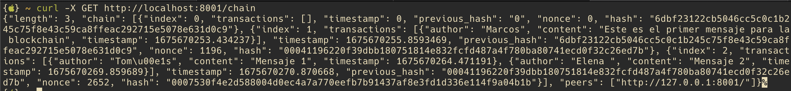

# Aplicación Python de blockchain

Vamos a construir un sitio web simple que permita a los usuarios compartir información mediante el uso de una blockchain que será inmutable y permanente. Además, los usuarios podrán interactuar con la aplicación a través de una sencilla interfaz web.

La estructura de la información que almacenaremos en la blockchain. La publicación tendrá tres partes:

1. Contenido.
2. Autor.
3. Fecha de publicación.

## Paso 1: Almacenar transacciones en bloque

Usaremos un formato JSON para almacenar la siguiente información:

```json
{
"author": "Nombre del autor",
"content": "Contenido del mensaje",
"timestamp": "La fecha del mensaje"
}
```

Lo anterior definirá una _**transacción**_

Las transacciones están empaquetadas en bloques. Un bloque puede contener una o mas transacciones. Los bloques que contienen las transacciones son generados con frecuencia y añadidos al blockchain. Dado que puede haber muchos bloques cada uno debe tener un identificador único

```python
class Block:
    def __init__(self, index, transactions, timestamp):
        """
        Constructor de la clase `Block`.
        :param index: ID único del bloque.
        :param transactions: Lista de transacciones.
        :param timestamp: Momento en que el bloque fue generado.
        """
        self.index = index
        self.transactions = transactions
        self.timestamp = timestamp
```

## Paso 2: Agregar firmas digitales a los bloques

La detección es el primer paso para prevenir cualquier tipo de manipulación en la información almacenada dentro de un bloque. Para detectar si la información de un bloque ha sido manipulada, podemos usar funciones _hash criptográficas_.

Una _**función hash**_ es una función que toma información de cualquier tamaño y a partir de ella produce otra información de un tamaño fijo (llamada _hash_), que generalmente sirve para identificar la información de entrada.

Las características de una función _hash_ ideal son:

- Debe ser computacionalmente fácil de calcular.
- Debe ser determinista: la misma información siempre genera el mismo hash.
- Debe ser uniformemente aleatoria: incluso el cambio de un simple bit de la información de entrada debe cambiar por completo el hash.

Las consecuencias de esto son:

- Es imposible adivinar la información de entrada a partir del hash de salida (la única forma es probar todas las combinaciones de información de entrada posibles).
- Si se conoce tanto la información de entrada como el hash, simplemente se puede pasar la información de entrada por la función hash para verificar el hash en cuestión.

_Blockchain_ saca provecho la asimetría entre los esfuerzos requeridos para averiguar el hash desde una información de entrada (algo muy fácil) y aquellos para averiguar la información de entrada a partir de un _hash_ (casi imposible) para obtener las características deseadas.

Vamos a guardar el hash de cada uno de los bloques en un campo dentro de nuestro objeto _**Block**_ para que actúe como una huella dactilar digital (o firma digital) de la información que contiene:

```python
from hashlib import sha256
import json
 
def compute_hash(self):
    """
    Convierte el bloque en una cadena JSON y luego retorna el hash
    del mismo.
    """
    # La cadena equivalente también considera el nuevo campo previous_hash,
    # pues self.__dict__ devuelve todos los campos de la clase.
    block_string = json.dumps(self.__dict__, sort_keys=True)
    return sha256(block_string.encode()).hexdigest()
```

_Nota: En la mayoría de las criptomonedas, las transacciones individuales dentro del bloque están cifradas y forman un árbol hash (también conocido como [árbol de Merkle](https://es.wikipedia.org/wiki/%C3%81rbol_de_Merkle)) donde la raíz del árbol puede ser usada como el hash del bloque. Como no es una condición necesaria para el funcionamiento del blockchain vamos a omitirlo para mantener las cosas algo más ordenadas y simples._

## Paso 3: Encadenar los bloques

Ya tenemos montados los bloques. El blockchain ha de ser una colección de bloques. Podemos almacenar todos los bloques en una lista de Python. Pero esto no es suficiente, ¿Qué sucede si alguien intencionalmente reemplaza un bloque en la colección? Crear un nuevo bloque con transacciones alteradas, calcular el hash y reemplazarlo por cualquier otro bloque anterior no es algo muy complejo...

Necesitamos una solución para asegurarnos de que cualquier cambio en los bloques anteriores invalide la cadena entera. La forma de resolver esto es creando una dependencia mutua entre bloques consecutivos al encadenarlos por el hash del bloque inmediatamente anterior a ellos. Es decir, se trata de incluir el hash del bloque anterior en el actual, a través de un nuevo campo llamado _previous_hash_.

Si cada bloque está enlazado al anterior por el campo previous_hash, ¿Qué sucede con el primer bloque de todos? El primer bloque es llamado el _bloque génesis_ y puede ser generado manualmente o por alguna lógica única. Agreguemos el campo _previous_hash_ a la clase _**Block**_ e implementemos la estructura inicial de nuestra clase Blockchain:

```python
from hashlib import sha256
import json
import time


class Block:
    def __init__(self, index, transactions, timestamp, previous_hash):
        """
        Constructor de la clase `Block`.
        :param index: ID único del bloque.
        :param transactions: Lista de transacciones.
        :param timestamp: Momento en que el bloque fue generado.
        """
        self.index = index
        self.transactions = transactions
        self.timestamp = timestamp
        # Agregamos un campo para el hash del bloque anterior.
        self.previous_hash = previous_hash
 
    def compute_hash(self):
        """
        Convierte el bloque en una cadena JSON y luego retorna el hash
        del mismo.
        """
        # La cadena equivalente también considera el nuevo campo previous_hash,
        # pues self.__dict__ devuelve todos los campos de la clase.
        block_string = json.dumps(self.__dict__, sort_keys=True)
        return sha256(block_string.encode()).hexdigest()


class Blockchain:
 
    def __init__(self, chain=None):
        """
        Constructor para la clase `Blockchain`.
        """
        self.unconfirmed_transactions = []
        self.chain = chain
        if self.chain is None:
            self.chain = []
            self.create_genesis_block()
 
    def create_genesis_block(self):
        """
        Una función para generar el bloque génesis y añadirlo a la
        cadena. El bloque tiene index 0, previous_hash 0 y un hash
        válido.
        """
        genesis_block = Block(0, [], 0, "0")
        genesis_block.hash = genesis_block.compute_hash()
        self.chain.append(genesis_block)
 
    @property
    def last_block(self):
        """
        Una forma rápida de retornar el bloque más reciente de la cadena.
        La cadena siempre contendrá al menos un último bloque (o sea,
        el bloque génesis).
        """
        return self.chain[-1]
```

Ahora si el contenido de cualquiera de los bloques anteriores cambia:

 - El hash del bloque anterior cambiará.
 - Esto provocará una discordancia con el campo _previous_hash_ en el bloque siguiente.
 - Puesto que la información de entrada para computar el hash de cualquier bloque también incluye el campo _previous_hash_, el hash del bloque siguiente cambiará también.

Al final, toda la cadena que sigue al bloque reemplazado será invalidada, y la única forma de arreglarlo es volver a computar toda la cadena.

## Paso 4: Implementar un algoritmo de prueba de trabajo

Aún así, hay un problema. Si cambiamos el bloque anterior, podemos recalcular de forma sencilla los hashes de todos los bloques siguientes y crear un blockchain diferente pero válido. Para evitarlo, vamos a usar la asimetría de esfuerzo de las funciones hash que mencionamos antes para hacer que la tarea de calcular un hash sea difícil y aleatoria. En lugar de aceptar cualquier hash para el bloque, le agregamos alguna restricción. En este caso, incluimos una restricción según la cual nuestro hash deba empezar con n ceros, donde n puede ser cualquier número positivo.

A menos que cambiemos el contenido del bloque, el hash no va a cambiar y no podemos cambiar la información que ya existe dentro del bloque. ¿Qué podemos hacer? Agregaremos algo de información ficticia que podamos cambiar, introduciendo un nuevo campo en nuestro bloque llamado _nonce_. 
Un _nonce_ es un número que cambiará constantemente hasta que obtengamos un hash que satisfaga nuestra restricción. 
El número de ceros especificados en la restricción decide la _dificultad_ de nuestro algoritmo de prueba de trabajo (cuanto más ceros, más difícil es averiguar el _nonce_).

Además, a causa de la asimetría, la prueba de trabajo es difícil de calcular pero fácil de verificar una vez que averiguamos el _nonce_ (para verificar, simplemente tienes que ejecutar la función hash nuevamente).

```python
class Blockchain:
    # Dificultad del algoritmo de prueba de trabajo.
    difficulty = 3

    def __init__(self, chain=None):
        self.unconfirmed_transactions = []
        self.chain = chain
        if self.chain is None:
            self.chain = []
            self.create_genesis_block()

    def create_genesis_block(self):
        """
        Una función para generar el bloque génesis y añadirlo a la
        cadena. El bloque tiene index 0, previous_hash 0 y un hash
        válido.
        """
        genesis_block = Block(0, [], 0, "0")
        genesis_block.hash = genesis_block.compute_hash()
        self.chain.append(genesis_block)

    @property
    def last_block(self):
        """
        Una forma rápida y pythonica de retornar el bloque más reciente de la cadena.
        Nótese que la cadena siempre contendrá al menos un último bloque (o sea,
        el bloque génesis).
        """
        return self.chain[-1]
 
    @staticmethod
    def proof_of_work(block):
        """
        Función que intenta distintos valores de nonce hasta obtener
        un hash que satisfaga nuestro criterio de dificultad.
        """
        block.nonce = 0
 
        computed_hash = block.compute_hash()
        while not computed_hash.startswith('0' * Blockchain.difficulty):
            block.nonce += 1
            computed_hash = block.compute_hash()
 
        return computed_hash
```

No hay una lógica concreta para averiguar el _nonce_ rápidamente; solo se puede hacer mediante fuerza bruta. La única mejora importante que puedes hacer es usar un equipo específicamente diseñado para computar funciones hash en un menor número de instrucciones de CPU.

## Paso 5: Añadir bloques a la cadena

Antes de agregar un bloque a la cadena tendremos que verificar:

- Que la información no ha sido adulterada (es decir, que la prueba de trabajo provista es correcta).
- Que el orden de las transacciones se preserve (es decir, que el campo _previous_hash_ del bloque a añadir sea igual que el hash del último bloque de nuestra cadena).

```python
class Blockchain:
    # Dificultad del algoritmo de prueba de trabajo.
    difficulty = 3

    def __init__(self, chain=None):
        self.unconfirmed_transactions = []
        self.chain = chain
        if self.chain is None:
            self.chain = []
            self.create_genesis_block()

    def create_genesis_block(self):
        """
        Una función para generar el bloque génesis y añadirlo a la
        cadena. El bloque tiene index 0, previous_hash 0 y un hash
        válido.
        """
        genesis_block = Block(0, [], 0, "0")
        genesis_block.hash = genesis_block.compute_hash()
        self.chain.append(genesis_block)

    @property
    def last_block(self):
        """
        Una forma rápida y pythonica de retornar el bloque más reciente de la cadena.
        Nótese que la cadena siempre contendrá al menos un último bloque (o sea,
        el bloque génesis).
        """
        return self.chain[-1]
 
    @staticmethod
    def proof_of_work(block):
        """
        Función que intenta distintos valores de nonce hasta obtener
        un hash que satisfaga nuestro criterio de dificultad.
        """
        block.nonce = 0
 
        computed_hash = block.compute_hash()
        while not computed_hash.startswith('0' * Blockchain.difficulty):
            block.nonce += 1
            computed_hash = block.compute_hash()
 
        return computed_hash

    def add_block(self, block, proof):
        """
        Una función que agrega el bloque a la cadena luego de la verificación.
        La verificación incluye:
        * Chequear que la prueba es válida.
        * El valor del previous_hash del bloque coincide con el hash del último
          bloque de la cadena.
        """
        previous_hash = self.last_block.hash
 
        if previous_hash != block.previous_hash:
            return False
 
        if not self.is_valid_proof(block, proof):
            return False
 
        block.hash = proof
        self.chain.append(block)
        return True
 
    def is_valid_proof(self, block, block_hash):
        """
        Comprobar si block_hash es un hash válido y satisface nuestro
        criterio de dificultad.
        """
        return (block_hash.startswith('0' * Blockchain.difficulty) and
                block_hash == block.compute_hash())
```

Las transacciones serán almacenadas inicialmente en un conjunto de transacciones no confirmadas. El proceso de poner transacciones no confirmadas en un bloque y calcular la prueba de trabajo es conocido como el minado de bloques. Una vez que el _nonce_ que satisface nuestra condición es averiguado, podemos decir que el bloque ha sido minado y puede ser colocado en el blockchain.

En la mayoría de las criptomonedas (como Bitcoin), los mineros suelen ser premiados con alguna criptomoneda como una recompensa por usar su potencia de cálculo para calcular la prueba de trabajo. Así sería nuestra función de minado.

```python
class Blockchain:
  
    # Dificultad del algoritmo de prueba de trabajo.
    difficulty = 3

    def __init__(self, chain=None):
        self.unconfirmed_transactions = []
        self.chain = chain
        if self.chain is None:
            self.chain = []
            self.create_genesis_block()

    def create_genesis_block(self):
        """
        Una función para generar el bloque génesis y añadirlo a la
        cadena. El bloque tiene index 0, previous_hash 0 y un hash
        válido.
        """
        genesis_block = Block(0, [], 0, "0")
        genesis_block.hash = genesis_block.compute_hash()
        self.chain.append(genesis_block)

    @property
    def last_block(self):
        """
        Una forma rápida y pythonica de retornar el bloque más reciente de la cadena.
        Nótese que la cadena siempre contendrá al menos un último bloque (o sea,
        el bloque génesis).
        """
        return self.chain[-1]
 
    @staticmethod
    def proof_of_work(block):
        """
        Función que intenta distintos valores de nonce hasta obtener
        un hash que satisfaga nuestro criterio de dificultad.
        """
        block.nonce = 0
 
        computed_hash = block.compute_hash()
        while not computed_hash.startswith('0' * Blockchain.difficulty):
            block.nonce += 1
            computed_hash = block.compute_hash()
 
        return computed_hash

    def add_block(self, block, proof):
        """
        Una función que agrega el bloque a la cadena luego de la verificación.
        La verificación incluye:
        * Chequear que la prueba es válida.
        * El valor del previous_hash del bloque coincide con el hash del último
          bloque de la cadena.
        """
        previous_hash = self.last_block.hash
 
        if previous_hash != block.previous_hash:
            return False
 
        if not self.is_valid_proof(block, proof):
            return False
 
        block.hash = proof
        self.chain.append(block)
        return True
 
    def is_valid_proof(self, block, block_hash):
        """
        Comprobar si block_hash es un hash válido y satisface nuestro
        criterio de dificultad.
        """
        return (block_hash.startswith('0' * Blockchain.difficulty) and
                block_hash == block.compute_hash())
 
    def mine(self):
        """
        Esta función sirve como una interfaz para añadir las transacciones
        pendientes al blockchain añadiéndolas al bloque y calculando la
        prueba de trabajo.
        """
        if not self.unconfirmed_transactions:
            return False
 
        last_block = self.last_block
 
        new_block = Block(index=last_block.index + 1,
                          transactions=self.unconfirmed_transactions,
                          timestamp=time.time(),
                          previous_hash=last_block.hash)
 
        proof = self.proof_of_work(new_block)
        self.add_block(new_block, proof)
        self.unconfirmed_transactions = []
        return new_block.index
```

## Paso 6: Interfaz

Vamos a usar una interfaz creada en el framework Flask que crea una API REST para interactuar e invocar varias operaciones en nuestro _blockchain_.

```python
# Inicializar la aplicación Flask
app =  Flask(__name__)
 
# Inicializar el objeto blockchain.
blockchain = None
peers = set()

chain_file_name = os.environ.get('DATA_FILE')
```

Las operaciones serán:
- _/new_transaction_ Para añadir nueva información al blockchain.
- _/chain_ Para obtener todas las transacciones.
- _/mine_ Para minar las transacciones sin confirmar.


```python
@app.route('/new_transaction', methods=['POST'])
def new_transaction():
    tx_data = request.get_json()
    required_fields = ["author", "content"]
 
    for field in required_fields:
        if not tx_data.get(field):
            return "Invalid transaction data", 404
 
    tx_data["timestamp"] = time.time()
 
    blockchain.add_new_transaction(tx_data)
 
    return "Success", 201

@app.route('/chain', methods=['GET'])
def get_chain():
    chain_data = []
    for block in blockchain.chain:
        chain_data.append(block.__dict__)
    return json.dumps({"length": len(chain_data),
                       "chain": chain_data,
                       "peers": list(peers)})

@app.route('/mine', methods=['GET'])
def mine_unconfirmed_transactions():
    result = blockchain.mine()
    if not result:
        return "No hay transacciones para minar"
    else:
        # Making sure we have the longest chain before announcing to the network
        chain_length = len(blockchain.chain)
        consensus()
        if chain_length == len(blockchain.chain):
            # announce the recently mined block to the network
            announce_new_block(blockchain.last_block)
        return "Se ha realizado el minado de un nuevo bloque con los mensajes pendientes"

```

## Paso 7: Establecer consenso y descentralización

El blockchain que hemos implementado hasta ahora está pensado para ser ejecutado en un solo ordenador. Aún enlazando bloques con hashes y aplicando la restricción de la prueba de trabajo, no podemos fiarnos de una única entidad (en este caso nuestro ordenador). Necesitamos múltiples nodos para mantener nuestro blockchain. Entonces, para pasar de un solo nodo a una red de pares, vamos a usar las operaciones:

- _/register_node_ Para añadir nuevos nodos a la red.
- _/register_with_ Para registrar el nodo actual con el nodo remoto.

```python
# Punto de acceso para añadir nuevos compañeros a la red.
@app.route('/register_node', methods=['POST'])
def register_new_peers():
    # La dirección del nodo compañero.
    node_address = request.get_json()["node_address"]
    if not node_address:
        return "Invalid data", 400

    # Añadir el nodo a la lista de compañeros.
    peers.add(node_address)

    # Retornar el blockhain al nuevo nodo registrado para que pueda sincronizar.
    return get_chain()

@app.route('/register_with', methods=['POST'])
def register_with_existing_node():
    """
    Internamente llama al punto de acceso `/register_node`
    para registrar el nodo actual con el nodo remoto especificado
    en la petición, y sincronizar el blockchain asimismo con el
    nodo remoto. 
    """
    node_address = request.get_json()["node_address"]
    if not node_address:
        return "Invalid data", 400

    data = {"node_address": request.host_url}
    headers = {'Content-Type': "application/json"}

    # Hacer una petición para registrarse en el nodo remoto y obtener
    # información.
    response = requests.post(node_address + "/register_node",
                             data=json.dumps(data), headers=headers)

    if response.status_code == 200:
        global blockchain
        global peers
        # Actualizar la cadena y los compañeros.
        chain_dump = response.json()['chain']
        blockchain = create_chain_from_dump(chain_dump)
        peers.update(response.json()['peers'])
        return "Registration successful ", 200
    else:
        # si algo sale mal, pasárselo a la respuesta de la API
        return response.content, response.status_code
```

Un nuevo nodo que participe en la red puede invocar la operación _register_with_existing_node_ para registrarse en los nodos existentes en la red. Esto facilitará lo siguiente:

- Solicitarle al nodo remoto que añada un nuevo compañero a su lista de compañeros conocidos.
- Iniciar el blockchain del nuevo nodo con el blockchain del nodo remoto.
- Resincronizar el blockchain con la red si el nodo se desconecta de la misma.

Sin embargo, hay un problema con los múltiples nodos. Debido a la manipulación intencional o por razones no intencionales (como latencia en la red), la copia de cadenas de algunos nodos puede diferir. En ese caso, necesitamos ponernos de acuerdo respecto de alguna versión de la cadena para mantener la integridad de todo el sistema. En otras palabras, necesitamos conseguir un _consenso_.

Un algoritmo simple de consenso podría ser ponernos de acuerdo respecto de la cadena válida más larga cuando las cadenas de diferentes participantes de la red aparentan divergir. Este procedimiento es aceptado ya que la cadena más larga es una buena estimación de la mayor cantidad de trabajo realizado (debido a que la prueba de trabajo tiene un alto coste computacional).

```python
def consensus():
    """
    Nuestro simple algoritmo de consenso. Si una cadena válida más larga es
    encontrada, la nuestra es reemplazada por ella.
    """
    global blockchain
 
    longest_chain = None
    current_len = len(blockchain.chain)
 
    for node in peers:
        response = requests.get('{}chain'.format(node))
        length = response.json()['length']
        chain = response.json()['chain']
        if length > current_len and blockchain.check_chain_validity(chain):
            current_len = length
            longest_chain = chain
 
    if longest_chain:
        blockchain = longest_chain
        return True
 
    return False
```

Por último, tenemos una operación para que cada nodo pueda anunciar a la red que ha minado un bloque para que todos puedan actualizar su blockchain:

- _/add_block_ Para añdir un bloque una vez que ha sido minado a la cadena.

```python
# punto de acceso para añadir un bloque minado por alguien más a la cadena del nodo.
@app.route('/add_block', methods=['POST'])
def verify_and_add_block():
    block_data = request.get_json()
    block = Block(block_data["index"],
                  block_data["transactions"],
                  block_data["timestamp"],
                  block_data["previous_hash"],
                  block_data["nonce"])
 
    proof = block_data['hash']
    try:
        blockchain.add_block(block, proof)
    except ValueError as e:
        return "El bloque ha sido descartado por el nodo: " + e.str(), 400
 
    return "Block added to the chain", 201
```

El método announce_new_block debería ser llamado después de que un bloque ha sido minado por el nodo, para que todos los nodos de la red lo puedan añadir a sus cadenas:

```python
def announce_new_block(block):
    for peer in peers:
        url = "{}add_block".format(peer)
        headers = {'Content-Type': "application/json"}
        requests.post(url,
                      data=json.dumps(block.__dict__, sort_keys=True),
                      headers=headers)
```

## Paso 8: Ejecutar la aplicación

Instalamos las dependencias

  $ pip install -r requirements.txt

Iniciamos un nodo para nuestro blockchain:

  $ export FLASK_APP=node_server.py
  $ flask run --port 8000


Con esto tenemos una instancia de nuestro nodo blockchain arrancada y corriendo en el puerto 8000.

Podemos consultar los bloques que tiene el nodo de la blockchain haciendo una petición al método _/chain_:

    $ curl -X GET http://localhost:8000/chain


En este caso solo tenemos un bloque (el bloque genesis):


## Paso 9: Ejecutar la interfaz

Con la aplicación arrancada, en una **nueva terminal**, ejecutamos la interfaz:

  $ python run_app.py


La aplicación estará arrancada en [http://localhost:5000](http://localhost:5000)

## Paso 10: Usar la interfaz

Esta es la interfaz de nuestra aplicación:


En la parte de abajo podemos ver el nodo _genesis_ de nuestra blockchain:



No tiene _hash_previo_, la fecha de creación tiene valor 0 (en informática la hora 0 es el 01/01/1970) y no tiene ningún mensaje. 

En la parte de arriba podemos crear un mensaje (o transacción) que consta del autor del mensaje y el contenido del mismo:


Al darle a enviar, enviamos la información pero aún no se añadirá al Blockchain hasta que hagamos el proceso de minado. Para ello pulsaremos el botón _Solicitar Minar_.
Si hay mensajes listos, se abrirá una nueva pestaña que nos informará del resultado:


Si pulsamos _Resincronizar_ en la ventana principal, veremos el resultado del bloque minado agregado a la blockchain:


Este bloque tiene como valor del campo _hash_anterior_ el hash del nodo genesis, un hash calculado con la dificultad que hemos establecido (empieza con 3 ceros). El nonce es el número de intentos que ha costado obtener el hash. Además, vemos que el bloque tiene el mensaje que hemos añadido.

Podemos añadir varios mensajes hasta realizar el minado. En este caso, el bloque que minaremos y que se añadirá al blockchain, contendrá todos los mensajes:


## Paso 11: Agregar nodos a nuestra red

Si solo tenemos un nodo levantado (el que está en el puerto 8000), dependemos de que este nodo esté levantado para que funcione nuestra blockchain. Esto en la realizada no funciona asi, ya que la blockchain ha de ser un sistema distribuido y descentralizado. Vamos a añadir otro nodo (lo levantaremos en el puerto 8001).

En una nueva ventana de comando, ejecutamos:

    $ export FLASK_APP=node_server.py
    $ flask run --port 8001

  

En este nodo, tendremos un único bloque genesis, pero no tiene noticias de los nodos de nuestra blockchain:

  
  
Tenemos que decirle al nodo que está corriendo en el puerto 8000 que registre este nuevo nodo. Para ello, en una nueva ventana de comando, ejecutamos:

    $ curl -X POST http://127.0.0.1:8001/register_with -H 'Content-Type: application/json' -d '{"node_address": "http://127.0.0.1:8000"}'

  

Esto hará que el nodo en el puerto 8000 esté al tanto del nodo en el puerto 8001 y viceversa. El nuevo nodo también sincronizará la cadena con el nodo existente de modo que puedan participar activamente en el proceso de minado.

Una vez añadido y sincronizado, si consultamos los bloques a este nuevo nodo, nos devuelve la cadena de nuestro blockchain:

    $ curl -X GET http://localhost:8001/chain



Si añadimos un nuevo bloque:


Y realizamos el minado:


Podemos ver que ambos nodos (8000 y 8001) se ha añadido el nuevo bloque a la cadena:

    $ curl -X GET http://localhost:8000/chain
    $ curl -X GET http://localhost:8001/chain


Si el nodo que corre en el puerto 8000 se cae o desaparece, podriamos usar el del 8001. Para comprobarlo, tenemos que cambiar el nodo con el que la aplicación frontend se sincroniza para minar (que por defecto es localhost:8000). Para ello, podemos parar la aplicación, cambiar el campo CONNECTED_NODE_ADDRESS en el archivo _views.py_ y hacer que use el nodo del 8001:

```js
# Nodo de la red blockchain con el que nuestra aplicación
# se comunicará para obtener y enviar información
CONNECTED_NODE_ADDRESS = "http://127.0.0.1:8001"
```

Una vez que hagas todo esto, podemos ejecutar de nuevo la aplicación:

    $ python run_app.py
    
Y se usará el nodo que está corriendo en el puerto 8001 para continuar añadiendo bloques a la blockchain.

